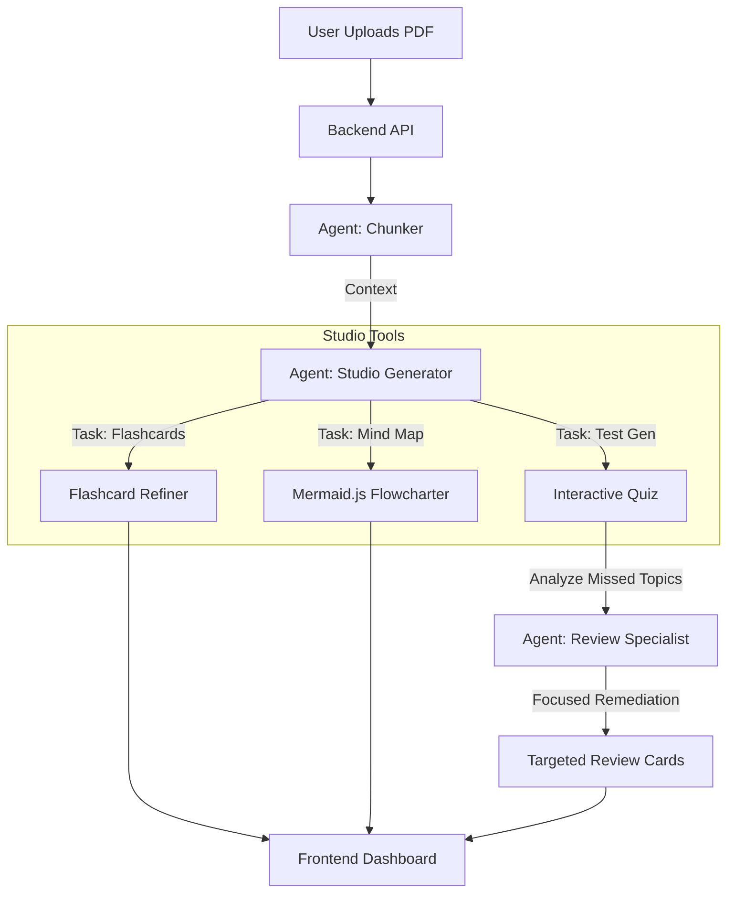

# ⚡ FlashDeck AI (Native AI Workshop)

> **"From PDF to Flashcards, Mind Maps, and Quizzes in Seconds — Powered by Groq AI."**

FlashDeck AI is a full-stack automated learning platform. It mimics the efficiency of **Google's DeckLM**, analyzing complex documents and intelligently synthesizing them into high-quality study materials using a **LangGraph Multi-Agent Architecture** powered by **Groq**.

---

## 🏗️ Architecture: The Agentic Workflow

We moved beyond simple RAG. FlashDeck uses a **Selective Agent Graph** to process documents and generate specialized study tools on-demand.



### 🧠 The Agents (LangGraph)
1.  **The Chunker**: Performs semantic splitting of large PDFs to maintain context for high-performance Llama models.
2.  **Studio Generator**: A versatile agent that handles multiple tasks (Cards, Mind Maps, Quizzes) using high-speed **Groq (Llama 3.3 70B)** logic.
3.  **Review Specialist**: A specialized agent that listens to your quiz results, identifies knowledge gaps, and creates targeted "remedial" flashcards.

---

## 🚀 Key Features

-   **High-Speed AI Interface**: Powered by **Groq** for near-instant generation (250+ tokens/sec).
-   **Personalized Library Dashboard**: Organize your notes with a beautiful, DeckLM-style library view.
-   **100% Free Public Beta**: All premium features (Pro and Team tiers) are accessible for $0 during our testing phase.
-   **Interactive Quiz System**: Test yourself with AI-generated MCQs directly inside the platform.
-   **Targeted Review**: Missed a question? The AI automatically creates focused study cards for those specific weak spots.
-   **Automated Mind Mapping**: Convert lecture notes into visual hierarchies using **Mermaid.js**.
-   **Glassmorphic 3D Interface**: Premium dark-mode aesthetics with custom AI-generated 3D illustrations.
-   **Universal Export**: 
    -   📸 **Image Grid** (PNG) for sharing.
    -   📄 **PDF** (High-Res) for printing.
    -   🎴 **Anki Package** (.apkg) for serious study.

---

## 🛠️ Tech Stack

### Backend (Python)
-   **Engine**: Groq (Llama 3.3 70B Versatile)
-   **Orchestration**: LangGraph, LangChain
-   **API Framework**: FastAPI
-   **Processing**: PyPDF for document extraction

### Frontend (React)
-   **Framework**: Vite + React + Framer Motion
-   **Authentication**: Firebase (Magic Links)
-   **Styling**: Vanilla CSS (Premium Dark Theme)
-   **Illustrations**: Custom AI-generated 3D assets

---

## 🌐 Deployment
For a detailed guide on how to deploy this app with automated GitHub sync (Vercel + Render), check out:
👉 **[Deployment Guide](./deployment.md)**

---

## ⚡ Quick Start

### 1. Backend Setup
```bash
cd backend
pip install -r requirements.txt

# Environment Setup
# Copy the example env file to .env
cp ../.env.example ../.env

# Edit the .env file with your specific keys:
# - GROQ_API_KEY (Recommended)
# - GOOGLE_API_KEY
# - OPENROUTER_API_KEY
```

```bash
# Run Server
source venv/bin/activate
uvicorn main:app --reload --port 8000
```

### 2. Frontend Setup
```bash
# Go to the frontend directory
npm install
npm run dev
```

Visit `http://localhost:5173` and start your high-speed study session! 🎓

---

## 🧑‍💻 Author

Created with 🤍 by **[Priyanshu Mishra](https://github.com/thepriyanshumishra)**.

Connect with me:
-   **X (Twitter)**: [@thedarkpcm](https://x.com/thedarkpcm)
-   **LinkedIn**: [Priyanshu Mishra](https://www.linkedin.com/in/thepriyanshumishra/)
-   **Instagram**: [@realpriyanshumishra](https://www.instagram.com/realpriyanshumishra)

## 🤝 Contributors

<a href="https://github.com/thepriyanshumishra/flashdeck-ai-web/graphs/contributors">
  
</a>

## 🌟 Star History

[](https://star-history.com/#thepriyanshumishra/flashdeck-ai-web&Date)
