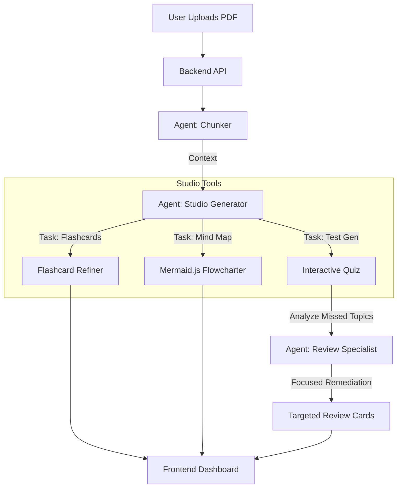

# ⚡ FlashDeck AI (Native AI Workshop)

> **"From PDF to Flashcards, Mind Maps, and Quizzes in Seconds — Powered by Groq AI."**

FlashDeck AI is a full-stack automated learning platform. It analyzes complex documents and intelligently synthesizing them into high-quality study materials using a **LangGraph Multi-Agent Architecture** powered by **Groq**.

---

## 🏗️ Architecture: The Agentic Workflow

We moved beyond simple RAG. FlashDeck uses a **Selective Agent Graph** to process documents and generate specialized study tools on-demand.



### 🧠 The Agents (LangGraph)
1.  **The Chunker**: Performs semantic splitting of large PDFs to maintain context for high-performance Llama models.
2.  **Studio Generator**: A versatile agent that handles multiple tasks (Cards, Mind Maps, Quizzes, Reports, Slides, Tables) using high-speed **Groq (Llama 3.3 70B)** logic.
3.  **Review Specialist**: A specialized agent that listens to your quiz results, identifies knowledge gaps, and creates targeted "remedial" flashcards.

---

## 🚀 Key Features

### 🎨 Premium Design
- **Glassmorphic 3D Interface**: Premium dark-mode aesthetics with custom AI-generated 3D illustrations.
- **Dynamic Interaction**: Hover effects, smooth transitions, and a "Notion-like" focus on content.

### 🧠 Intelligent Study Tools
- **High-Speed AI**: Powered by **Groq** for near-instant generation (250+ tokens/sec).
- **Interactive Quiz System**: Test yourself with AI-generated MCQs and get instant feedback.
- **Targeted Review**: The AI automatically identifies knowledge gaps from quiz performance and creates focused study cards.
- **Automated Mind Mapping**: Convert lecture notes into visual hierarchies using **Mermaid.js**.
- **Deep Research Reports**: Generate comprehensive Markdown reports from your documents.

### 📂 Organization & Export
- **Personalized Library**: Organize your notes with a beautiful dashboard view.
- **Universal Export**: 
    - 📸 **Image Grid** (PNG) for sharing.
    - 📄 **PDF** (High-Res) for printing.
    - 🎴 **Anki Package** (.apkg) for serious study.

---

## 🛠️ Tech Stack

### Frontend (React)
- **Framework**: Vite + React + Framer Motion
- **Authentication**: Firebase (Magic Links)
- **Database**: Supabase
- **Styling**: Vanilla CSS (Premium Dark Theme)
- **Visuals**: Mermaid.js, KaTeX, Lucide Icons

### Backend (Python)
- **Engine**: Groq (Llama 3.3 70B Versatile), Google Gemini
- **Orchestration**: LangGraph, LangChain
- **API Framework**: FastAPI
- **Audio**: OpenAI TTS / Google TTS for Podcasts & Lessons

---

## ⚡ Quick Start

### 1. Backend Setup
```bash
cd backend
python -m venv venv
source venv/bin/activate  # On Windows: venv\Scripts\activate
pip install -r requirements.txt

# Create .env in the root directory
# Required: GOOGLE_API_KEY, GROQ_API_KEY
```

```bash
# Run Server
uvicorn main:app --reload --port 8000
```

### 2. Frontend Setup
```bash
cd frontend
npm install

# Create .env in the frontend directory
# Required: VITE_SUPABASE_URL, VITE_SUPABASE_ANON_KEY
# Optional: Firebase config if using Auth features
```

```bash
# Run App
npm run dev
```

Visit `http://localhost:5173` and start your high-speed study session! 🎓

---

## 🧑‍💻 Author

Created with 🤍 by **[Priyanshu Mishra](https://github.com/thepriyanshumishra)**.

Connect with me:
- **X (Twitter)**: [@thedarkpcm](https://x.com/thedarkpcm)
- **LinkedIn**: [Priyanshu Mishra](https://www.linkedin.com/in/thepriyanshumishra/)
- **Instagram**: [@realpriyanshumishra](https://www.instagram.com/realpriyanshumishra)

## 🌟 Star History

[](https://star-history.com/#thepriyanshumishra/flashdeck-ai-web&Date)
