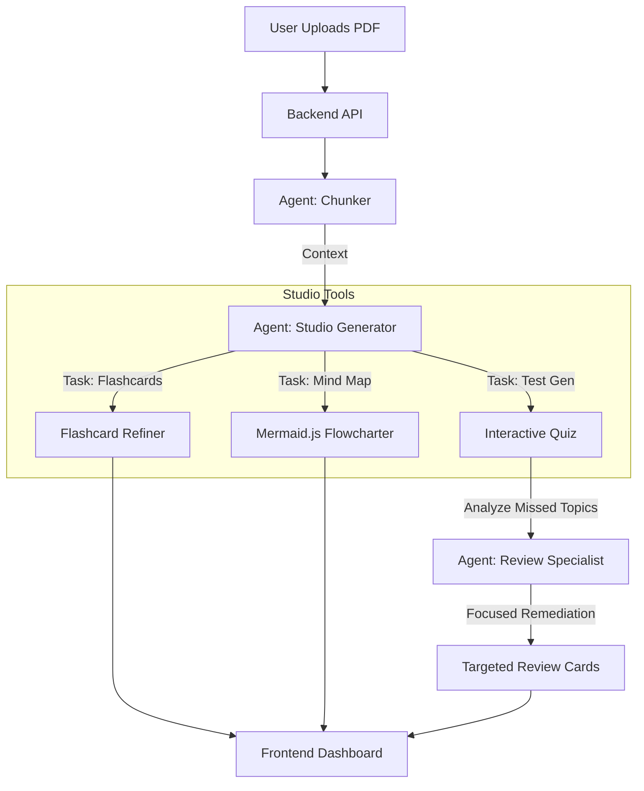

# ⚡ FlashDeck AI (Native AI Workshop)

> **"From PDF to Flashcards, Mind Maps, and Quizzes in Seconds — Powered by Groq AI."**

FlashDeck AI is a full-stack automated learning platform. It analyzes complex documents and intelligently synthesizing them into high-quality study materials using a **LangGraph Multi-Agent Architecture** powered by **Groq**.

---

## 🛡️ Recent Updates (v2.1)

-   **Code Quality**: Achieved **Zero Lint Errors/Warnings** across the entire codebase. Systematically resolved over 15+ issues related to unused code, React hook dependencies, and performance-impacting synchronous state updates.
-   **Security Enhancements**: Implemented **Cross-Origin-Opener-Policy (COOP)** security headers to ensure seamless and secure Firebase Authentication popup flows.
-   **Performance Optimization**: Refactored the `DeckDashboard` and `QuizPage` components to eliminate cascading renders, ensuring ultra-smooth AI generation UI.
-   **Reliability**: Strengthened `useDeck` context hooks with more robust state management and cleanup logic to prevent memory leaks and stale data.

--- 

## 🏗️ Architecture: The Agentic Workflow

We moved beyond simple RAG. FlashDeck uses a **Selective Agent Graph** to process documents and generate specialized study tools on-demand.


```mermaid
graph TD
    User[User Uploads PDF] --> B[Backend API]
    B --> A1[Agent: Chunker]
    A1 -->|Context| A2[Agent: Studio Generator]
    
    subgraph Studio Tools
        A2 -->|Task: Flashcards| C[Flashcard Refiner]
        A2 -->|Task: Mind Map| D[Mermaid.js Flowcharter]
        A2 -->|Task: Test Gen| E[Interactive Quiz]
    end
    
    E -->|Analyze Missed Topics| A3[Agent: Review Specialist]
    A3 -->|Focused Remediation| F[Targeted Review Cards]
    
    C --> UI[Frontend Dashboard]
    D --> UI
    F --> UI
```

### 🧠 The Agents (LangGraph)
1.  **The Chunker**: Performs semantic splitting of large PDFs to maintain context for high-performance Llama models.
2.  **Studio Generator**: A versatile agent that handles multiple tasks (Cards, Mind Maps, Quizzes, Reports, Slides, Tables) using high-speed **Groq (Llama 3.3 70B)** logic.
3.  **Research Specialist (Tavily)**: A new researcher agent that uses the **Tavily AI** search engine to fetch real-world context and latest updates to enhance your study reports.
4.  **Review Specialist**: A specialized agent that listens to your quiz results, identifies knowledge gaps, and creates targeted "remedial" flashcards.

---

## 🚀 Key Features

### 🎨 Premium Design
- **Glassmorphic 3D Interface**: Premium dark-mode aesthetics with custom AI-generated 3D illustrations.
- **Dynamic Interaction**: Hover effects, smooth transitions, and a "Notion-like" focus on content.
- **AI Cover Images (Unsplash)**: Every deck automatically gets a high-quality, relevant background image via the **Unsplash API**.

### 🧠 Intelligent Study Tools
- **High-Speed AI**: Powered by **Groq** for near-instant generation (250+ tokens/sec).
- **Interactive Quiz System**: Test yourself with AI-generated MCQs and get instant feedback.
- **Targeted Review**: The AI automatically identifies knowledge gaps from quiz performance and creates focused study cards.
- **Automated Mind Mapping**: Convert lecture notes into visual hierarchies using **Mermaid.js**.
- **Deep Research (Live Search)**: Comprehensive Markdown reports enhanced with real-time web context via **Tavily AI**.
- **Human-Like Audio (ElevenLabs)**: Generate podcasts and lessons with ultra-realistic AI voices.

### 📂 Organization & Export
- **Personalized Library**: Organize your notes with a beautiful dashboard view.
- **Universal Export**: 
    - 📸 **Image Grid** (PNG) for sharing.
    - 📄 **PDF** (High-Res) for printing.
    - 🎴 **Anki Package** (.apkg) for serious study.
- **Email Delivery (Resend)**: Send your study materials directly to your inbox with a single click.

---

## 🛠️ Tech Stack

### Frontend (React)
- **Framework**: Vite + React + Framer Motion
- **Authentication**: Firebase (Magic Links)
- **Database**: Supabase
- **Styling**: Vanilla CSS (Premium Dark Theme)
- **Visuals**: Unsplash API for cover images.

### Backend (Python)
- **Engine**: Groq (Llama 3.3 70B Versatile), Google Gemini
- **Orchestration**: LangGraph, LangChain
- **API Framework**: FastAPI
- **Search**: Tavily AI
- **Audio**: ElevenLabs (Premium) / Google TTS
- **Email**: Resend API

---

## ⚡ Quick Start (Manual Launch)

### 1. Configuration
Create a `.env` file in the **root directory** with the following keys:

```bash
# --- LLM Keys ---
GROQ_API_KEY=your_groq_key
GOOGLE_API_KEY=your_google_key
AI_MODEL=llama-3.3-70b-versatile

# --- Premium Features ---
TAVILY_API_KEY=your_tavily_key       # For Web Research
UNSPLASH_ACCESS_KEY=your_unsplash_key # For Cover Images
RESEND_API_KEY=your_resend_key       # For Email Reports
ELEVENLABS_API_KEY=your_elevenlabs_key # For Premium Voices

# --- Frontend Keys ---
VITE_SUPABASE_URL=your_supabase_url
VITE_SUPABASE_ANON_KEY=your_anon_key
VITE_API_URL=http://127.0.0.1:8000
```

### 2. Manual Startup

#### Step A: Run the Backend
Open a terminal and run:
```bash
cd backend
python -m venv venv
source venv/bin/activate  # Windows: venv\Scripts\activate
pip install -r requirements.txt
uvicorn main:app --reload --port 8000
```

#### Step B: Run the Frontend
Open a **new** terminal and run:
```bash
cd frontend
npm install
npm run dev
```

Visit `http://localhost:5173` and start your high-speed study session! 🎓

---

## 🧑‍💻 Author

Created with 🤍 by **[Priyanshu Mishra](https://github.com/thepriyanshumishra)**.

Connect with me:
- **X (Twitter)**: [@thedarkpcm](https://x.com/thedarkpcm)
- **LinkedIn**: [Priyanshu Mishra](https://www.linkedin.com/in/thepriyanshumishra/)
- **Instagram**: [@realpriyanshumishra](https://www.instagram.com/realpriyanshumishra)

## 🌟 Star History

[](https://star-history.com/#thepriyanshumishra/flashdeck-ai-web&Date)
